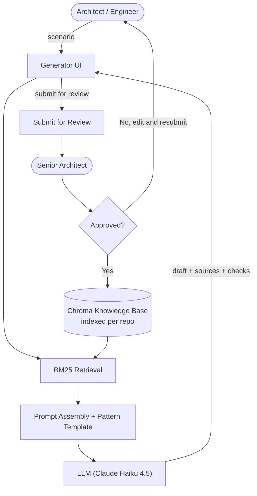

# pr-reviewer-agent

*A GitHub App that reviews pull requests using an LLM agent, RAG over repo history, and signal-derived confidence scoring.*

[](https://github.com/SammyBolger/pr-reviewer-agent/actions/workflows/ci.yml)
[](https://github.com/SammyBolger/pr-reviewer-agent/actions/workflows/fly-deploy.yml)
[](LICENSE)

Install it on any repository and every pull request gets an automated code review comment within about 20 seconds. The review is grounded in the repo's own docs and shows the sources the model used, so the reader can tell whether to trust it. Deployed live and running on Fly.

**Live:** https://pr-reviewer-agent.fly.dev

---

## Overview

Engineers wait hours or days for a human review on a PR. This app cuts the first-pass review down to seconds by running the diff through a LangGraph agent that retrieves related repository context, calls Claude with structured output, and posts a Markdown review comment on the PR. It is a working, deployed product that reviews its own PRs.

## Features

- Auto-reviews every opened or updated pull request with a structured Markdown comment
- Grounds every review in a per-repo Chroma RAG index built from the project's own docs
- Structured LLM output via Anthropic tool use, validated against a Pydantic schema
- Signal-derived confidence (citation validity, diff completeness, RAG strength, model self-report) instead of the model's flat 0.75 self-report
- LLM-as-judge eval harness with a labeled dataset and a prompt A/B framework across three system-prompt variants
- MCP server exposing review stats to Claude Desktop or any MCP client
- `.reviewbot.yml` per-repo config for skip paths, min diff size, and repo-specific instructions
- `/review-again` slash command to re-trigger a review from a PR comment
- Token and cost tracking in SQLite with a `/dashboard` endpoint
- Diff chunking (map-reduce) for pull requests too large for a single LLM call

## Screenshots / Demo

A real review the bot posted on one of its own pull requests:

> ## PR Reviewer Agent
>
> **Summary.** Refactors review flow into a LangGraph state machine with a linear DAG.
>
> **Concerns**
> - 🟡 **clarity** in `app/agent/state.py`: `ReviewState` uses `TypedDict(total=False)`, making all fields optional. This weakens type safety since nodes assume fields exist.
> - 🟡 **bug** in `app/review/runner.py`:16: The logging statement assumes the review operation succeeded, but is called before checking if `result` contains a `'review'` key.
>
> **Nice work**
> - Clean separation of concerns: each node has a single responsibility.
>
> _Confidence: 0.88_
> _Signals: citation 1.00, completeness 1.00, context 0.60, model 0.75_

Browse more real reviews on the [pull requests page](https://github.com/SammyBolger/pr-reviewer-agent/pulls?q=is%3Apr).

## Tech Stack

- **FastAPI on Python 3.11**: webhook receiver and dashboard HTTP server
- **LangGraph**: orchestrates the review flow as a 6-node state machine (extract to authenticate to load_config to fetch to retrieve to review to post)
- **Anthropic Claude Haiku 4.5**: the reviewer model, chosen over Sonnet for cost on high-frequency reviews
- **Anthropic Claude Sonnet 4.6**: the LLM-as-judge used only inside the eval harness where quality matters more than latency
- **Chroma (persistent)**: vector store, one collection per repo, keyed by repo slug
- **BM25**: keyword-based retrieval, chosen over dense embeddings because the indexed doc set is small
- **SQLAlchemy 2.0 + SQLite + aiosqlite**: review history and cost tracking
- **slowapi**: rate limiting (60/min default, 300/min on `/webhook`, 30/min on `/dashboard`)
- **MCP SDK**: exposes reviewer stats as an MCP server that plugs into Claude Desktop
- **GitHub Apps SDK** (via `pyjwt` + `httpx`): App-level JWT and installation tokens
- **Fly.io** with a multi-stage Docker build, deployed automatically via GitHub Actions

## Architecture



When a webhook arrives, the LangGraph state machine runs six nodes in order. `extract` pulls PR metadata off the payload. `authenticate` mints a GitHub App installation token. `load_config` fetches an optional `.reviewbot.yml` from the target repo. `fetch` pulls the diff and applies skip rules. `retrieve` looks up related repo context via the Chroma index (building it on first review of a repo). `review` calls Claude with the diff plus retrieved context, computes the calibrated confidence from real signals, and formats the result as Markdown. `post` writes the comment to the PR.

## Project Structure

```
pr-reviewer-agent/
├── app/
│   ├── main.py              # FastAPI app, /webhook, /health, /dashboard, /
│   ├── config.py            # env-driven settings (pydantic-settings)
│   ├── config_repo.py       # per-repo .reviewbot.yml loader
│   ├── middleware.py        # BodySizeLimitMiddleware
│   ├── mcp_server.py        # MCP server exposing review stats
│   ├── agent/               # LangGraph state machine + shared state
│   ├── github/              # App auth, diff fetch, comment posting
│   ├── llm/                 # Claude client, prompt templates
│   ├── retrieval/           # Chroma client + repo doc indexer
│   ├── review/              # Review schemas, formatter, calibrator, chunking
│   ├── db/                  # SQLAlchemy models + async session
│   └── evals/               # dataset, LLM-as-judge, prompt A/B runner
├── tests/                   # pytest suite (66 tests)
├── Dockerfile               # multi-stage, runs as non-root
├── docker-compose.yml       # one-command local spinup
├── fly.toml                 # Fly.io deployment config
└── pyproject.toml
```

## Installation & Setup

**Prerequisites**
- Python 3.11 or higher
- A GitHub App (see [creating a GitHub App](https://docs.github.com/en/apps/creating-github-apps))
- An Anthropic API key ([console.anthropic.com](https://console.anthropic.com))

**Local setup**

```bash
git clone https://github.com/SammyBolger/pr-reviewer-agent.git
cd pr-reviewer-agent

python3 -m venv .venv
source .venv/bin/activate
pip install -e ".[dev]"

cp .env.example .env
# fill in GITHUB_APP_ID, GITHUB_WEBHOOK_SECRET, ANTHROPIC_API_KEY, DASHBOARD_TOKEN
# and put your GitHub App private key at ./secrets/github-app.pem

uvicorn app.main:app --reload --port 8000
```

For local webhook testing, expose port 8000 with `ngrok http 8000` or `cloudflared tunnel --url http://localhost:8000` and paste that public URL into your GitHub App's Webhook URL setting.

**With Docker Compose**

```bash
docker compose up --build
```

## Usage

1. Install the GitHub App on any repo you want reviews on.
2. Open a pull request. The bot posts a review comment within about 20 seconds.
3. Comment `/review-again` on any PR to force a fresh review.
4. Add a `.reviewbot.yml` to the repo root to customize behavior:
   ```yaml
   skip_paths:
     - "docs/**"
     - "*.md"
   min_diff_lines: 10
   extra_instructions: |
     Focus on security-sensitive changes. Deprioritize style comments.
   ```

## API Documentation

| Method | Endpoint | Description | Auth |
|---|---|---|---|
| GET | `/` | App metadata and endpoint list | none |
| GET | `/health` | Liveness check | none |
| POST | `/webhook` | GitHub webhook receiver | HMAC signature |
| GET | `/dashboard` | Review history and aggregate cost | Bearer token |

## Engineering Decisions

**BM25 retrieval over dense embeddings.** Dense embeddings were the default first instinct. For a small per-repo doc set (typically under 200 docs), BM25 with keyword extraction from the changed-file list gives about 90% of the retrieval quality without the embedding-model dependency, the vector-DB cost, and the ANN tuning complexity. Chroma is still used as the store because its default `all-MiniLM-L6-v2` embeddings are useful as a fallback layer, but the primary retrieval path is keyword-based.

**Signal-derived confidence over LLM self-report.** Every review the model produced parked confidence at 0.75 for anything non-trivial (a well-documented mode-collapse pattern with self-reported confidence). Replaced with a weighted score of citation validity (are the concerns pointing at real files in the diff?), diff completeness (did the model see the whole diff?), context strength (did RAG return anything?), and the model's self-report as one input among four. Now confidence actually varies from ~0.4 to ~0.95 based on measurable signals.

**LangGraph over hand-rolled orchestration.** The review flow could have been a single Python function. LangGraph adds ceremony but gives the flow explicit named nodes with a compiled state graph, which makes it debuggable, testable per node, and easy to add conditional branches (like the `skip` short-circuit when `.reviewbot.yml` says to skip). It also carries the 2026 agentic AI keyword weight that a plain function does not.

**Claude Haiku for reviews, Sonnet for the judge.** Haiku 4.5 is about 15x cheaper per token than Sonnet 4.6 and fast enough for interactive review turnaround. The eval harness uses Sonnet because the judge's job is harder than the reviewer's, and the judge only runs during offline eval sweeps where quality matters and latency does not.

**Structured output via tool use, not JSON mode.** The `submit_review` tool has a strict Pydantic-derived JSON schema. If the model returns anything off-schema, `Review.model_validate` fails and the review flow throws. This is stricter than JSON mode and catches malformed output at the boundary instead of downstream.

**Multi-stage Docker + non-root user.** The runtime image is `python:3.14-slim` with only the venv copied in, no `build-essential`, no cache. The container runs as an unprivileged `app` user with no shell. The service runs behind HMAC signature verification, rate limiting (300/min on the webhook), and a body-size middleware (2 MB, enforced on the wire) so a malicious client cannot exhaust memory even without a valid Content-Length header.

**Prompt-injection delimiters.** The diff and retrieved context are wrapped in `<UNTRUSTED_DIFF>` and `<UNTRUSTED_CONTEXT>` tags, and the system prompt explicitly points at those delimiters and tells the model to treat everything inside as untrusted data. This is a standard defense-in-depth pattern for LLMs that read user-controlled input.

## Testing

```bash
pytest -q
```

**66 tests** covering:
- HMAC webhook signature verification
- Body size middleware, both integration and raw-ASGI edge cases (chunked upload, malformed Content-Length, disconnect during streaming)
- Confidence calibrator (citation validity, completeness, context strength, weighted score)
- Markdown formatter output
- Diff parsing and file extraction
- Chunking (split by file, group under `MAX_DIFF_CHARS`, aggregate partial reviews)
- Repo config parsing (`.reviewbot.yml` skip patterns, min diff line counter)
- Slash-command recognition
- Dashboard bearer-token auth (missing header, wrong token, correct token, 404 when unconfigured)
- Env var loading through `pydantic-settings`
- Cost pricing lookup
- GitHub API client with `respx`-mocked HTTP (diff fetch, comment post, error handling)
- Doc indexer with mocked GitHub Contents API (README + `docs/` walk)
- Root route metadata + secret-leak regression

CI runs `ruff check` and `pytest` on every pull request and every push to `main` via GitHub Actions.

## Limitations & Future Improvements

- The Chroma index rebuilds from scratch on the first review of each repo after a container restart. On Fly's shared VM this takes about 15 seconds. A background pre-warm on startup would fix it.
- No horizontal scaling. The persistent Chroma volume is single-writer, so scaling to multiple Fly machines would need a real vector database (Pinecone, Weaviate, pgvector) or a shared filesystem.
- No cost budget or per-repo rate limit. A malicious install could burn through the Anthropic bill. Would add a monthly budget alert and per-installation throttling before opening the App to strangers.
- Reviews look at code inside test-fixture files (like intentionally-buggy diffs in `app/evals/dataset.py`) as if they were production code. Adding a heuristic to weight paths lower under `tests/` or `evals/` would clean this up.
- The prompt A/B framework runs manually. Would like to wire it into CI so prompt changes need a signed-off eval delta before merging.

## License

[MIT](LICENSE)
