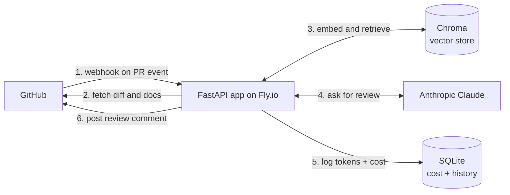

# pr-reviewer-agent

*A GitHub App I built that leaves an automatic code review on every pull request within about 20 seconds.*

[](https://github.com/SammyBolger/pr-reviewer-agent/actions/workflows/ci.yml)
[](https://github.com/SammyBolger/pr-reviewer-agent/actions/workflows/fly-deploy.yml)
[](LICENSE)

Install the App on a repo, open a PR, and a bot comment shows up before you can grab a coffee. The review is grounded in the repo's own docs and shows the sources it used, so you can tell whether to trust it. It runs live at [pr-reviewer-agent.fly.dev](https://pr-reviewer-agent.fly.dev).

---

## Why I built this

Waiting hours or days for a first review on a PR is the biggest slowdown on personal projects. I wanted something that read the diff the second I opened the PR, told me what looked off, and pointed at the specific lines. I also wanted it to be honest about what it wasn't sure about, which is why I built the confidence score around real signals instead of asking the LLM to guess.

## Features

- Reviews every PR automatically the moment it opens or updates
- Pulls in relevant repo docs so the reviewer knows the project's own conventions
- Structured Markdown output (summary, changes, concerns with severity, strengths, confidence)
- Real confidence score, not a made-up one
- LLM-as-judge eval harness with three test cases and a prompt A/B runner
- `.reviewbot.yml` per-repo config for skipping paths or adding custom guidance
- `/review-again` slash command to re-run a review from a PR comment
- Token and cost tracking so you can see what each review costs
- MCP server so you can query review history from Claude Desktop
- Handles huge PRs by splitting them into chunks and merging the reviews

## Screenshots

Here's a real review the bot posted on one of its own PRs:

> ## PR Reviewer Agent
>
> **Summary.** Refactors review flow into a LangGraph state machine.
>
> **Concerns**
> - 🟡 **clarity** in `app/agent/state.py`: `ReviewState` uses `TypedDict(total=False)` so all fields are optional, but nodes assume they exist.
> - 🟡 **bug** in `app/review/runner.py`:16: logs before checking that `result` actually has a `review` key.
>
> **Nice work**
> - Clean separation of concerns: each node has one job.
>
> _Confidence: 0.88_
> _Signals: citation 1.00, completeness 1.00, context 0.60, model 0.75_

More reviews on the [pull requests page](https://github.com/SammyBolger/pr-reviewer-agent/pulls?q=is%3Apr).

## Tech Stack

- **Python 3.11 + FastAPI** for the webhook receiver
- **LangGraph** to orchestrate the review pipeline
- **Anthropic Claude Haiku 4.5** as the reviewer (cheap, fast)
- **Anthropic Claude Sonnet 4.6** as the judge in the eval harness
- **Chroma** for the per-repo vector store
- **SQLAlchemy + SQLite** for cost and review history
- **Fly.io** for hosting, multi-stage Docker, auto-deployed via GitHub Actions

## Architecture



**Walkthrough.** GitHub sends a webhook when a PR opens. My FastAPI service checks the HMAC signature and hands the payload to a background task. The task runs a small LangGraph pipeline: fetch the diff, look up related repo docs (indexed in Chroma), ask Claude for a review, calibrate the confidence, then post a Markdown comment on the PR. Every call gets logged to SQLite so I can see what I'm spending.

## Installation & Setup

**You'll need:**
1. Python 3.11 or newer
2. A GitHub App you own ([how to create one](https://docs.github.com/en/apps/creating-github-apps))
3. An Anthropic API key ([get one here](https://console.anthropic.com))

**Get it running locally:**

```bash
git clone https://github.com/SammyBolger/pr-reviewer-agent.git
cd pr-reviewer-agent

python3 -m venv .venv
source .venv/bin/activate
pip install -e ".[dev]"

cp .env.example .env
# fill in the .env values
# drop your GitHub App private key at ./secrets/github-app.pem

uvicorn app.main:app --reload --port 8000
```

For local webhook testing, expose port 8000 with ngrok or Cloudflare Tunnel and use the public URL in your GitHub App's Webhook URL setting.

**Or just spin up Docker:**

```bash
docker compose up --build
```

## Usage

1. Install the GitHub App on any repo you want reviews on.
2. Open a pull request. That's it. The bot posts a review within 20 seconds.
3. If you want a fresh review, comment `/review-again` on the PR.
4. Want to customize behavior on a specific repo? Drop a `.reviewbot.yml` at the repo root:
   ```yaml
   skip_paths:
     - "docs/**"
     - "*.md"
   min_diff_lines: 10
   extra_instructions: |
     Focus on security-sensitive changes. Ignore style comments.
   ```

## API

| Method | Endpoint | What it does | Auth |
|---|---|---|---|
| GET | `/` | App info | none |
| GET | `/health` | Health check | none |
| POST | `/webhook` | Where GitHub sends events | HMAC |
| GET | `/dashboard` | Review history and cost | Bearer token |

## Engineering Decisions

- **BM25 keyword retrieval over dense embeddings** because the doc set per repo is small and BM25 is cheaper and simpler.
- **Signal-derived confidence over LLM self-report** because every model call otherwise returned 0.75 no matter what.
- **LangGraph over a plain Python function** because named nodes are easier to debug and test in isolation.
- **Claude Haiku 4.5 for reviews** because it's about 15x cheaper than Sonnet and fast enough.
- **Claude Sonnet 4.6 only in the eval harness** because judging is harder than reviewing and evals run offline.
- **Structured output via tool use, not JSON mode** because a Pydantic-validated schema catches bad output at the boundary.
- **Multi-stage Docker with a non-root user** because the runtime image should have zero build tooling and no privileged access.
- **Prompt-injection delimiters around diffs** because the diff is user-controlled input and I don't want it hijacking the reviewer.

## Testing

```bash
pytest -q
```

**66 tests** covering webhook signature verify, the confidence calibrator, the Markdown formatter, diff parsing, chunking, repo config, slash-command detection, dashboard auth, env loading, cost math, mocked GitHub API calls, and the root route.

CI runs `ruff check` and `pytest` on every PR and every push to `main`.

## Limitations & Future Improvements

- Chroma rebuilds the repo index from scratch on the first review after a machine restart.
- No horizontal scaling. The persistent Chroma volume is single-writer, so scaling out would need a managed vector database.
- No hard per-repo rate limit or cost budget baked in yet.
- The reviewer sometimes flags intentionally-buggy code inside `app/evals/dataset.py` as if it were production code.
- The prompt A/B eval runs manually. I want it in CI so prompt changes need a signed-off eval delta.

## License

[MIT](LICENSE)
